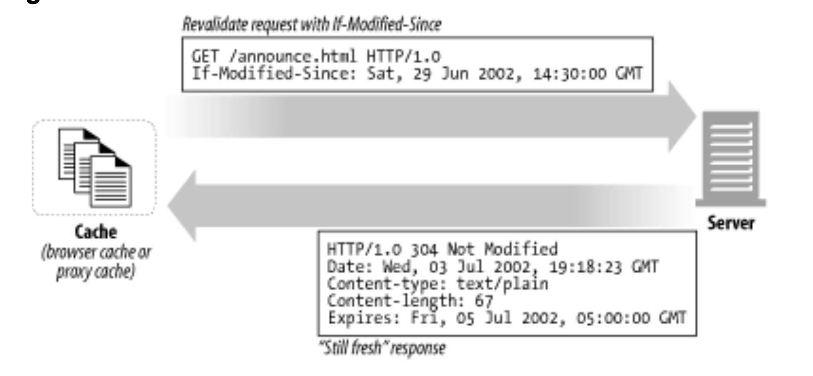

# 캐시
- [캐시](#캐시)
  - [캐시가 해결해주는 문제들](#캐시가-해결해주는-문제들)
    - [불필요한 데이터 전송](#불필요한-데이터-전송)
      - [캐시를 사용하지 않는 경우](#캐시를-사용하지-않는-경우)
      - [캐시를 사용하는 경우](#캐시를-사용하는-경우)
    - [대역폭 병목](#대역폭-병목)
    - [급격한 트래픽 증가(Flash Crowds)](#급격한-트래픽-증가flash-crowds)
    - [거리로 인한 지연](#거리로-인한-지연)
  - [적중(Hit)과 부적중(Miss)](#적중hit과-부적중miss)
    - [재검사(Revalidation)](#재검사revalidation)
      - [GET If-Modified-Since 상황](#get-if-modified-since-상황)
        - [서버 컨텐츠가 변경되지 않은 경우(재검사 적중)](#서버-컨텐츠가-변경되지-않은-경우재검사-적중)
        - [서버 컨텐츠가 변경된 경우](#서버-컨텐츠가-변경된-경우)
        - [객체가 삭제된 경우](#객체가-삭제된-경우)
      - [적중률](#적중률)
      - [바이트 적중률](#바이트-적중률)
      - [적중과 부적중의 구별](#적중과-부적중의-구별)
  - [캐시 포폴로지](#캐시-포폴로지)
    - [개인 캐시](#개인-캐시)

## 캐시가 해결해주는 문제들
### 불필요한 데이터 전송
> 캐시는 불필요한 데이터 전송을 줄여서, 네트워크 비용을 줄여준다.

#### 캐시를 사용하지 않는 경우
1. 여러 클라이언트가 원서버로 같은 데이터 요청
2. 원서버는 각 클라리언트에게 응답
3. 네이트워크 대역폭을 차지
4. 전송이 느려짐
5. 웹 서버에 부하

#### 캐시를 사용하는 경우
1. 서버의 응답을 캐시에 보관
2. 캐시된 사본을 다른 클라이언트로 응답
3. 원서버의 부하 감소

### 대역폭 병목
> 캐시는 대역폴을 늘리지 않고 페이지 응답 속도를 높인다.

- 대부분 원격 서버보다 로컬 클라이언트에 더 넓은 대역폭 제공
- WAN보다 빠른 LAN에서 데이터를 가져온다면 캐싱 성능 향상 가능

### 급격한 트래픽 증가(Flash Crowds)
> 캐시는 원서버에 대한 요청을 줄여 서버 부허를 줄이고 빠른 응답 가능

- 급격히 트래픽이 증가한경우 캐시가 대신 응당해줄 수 있다.
  
### 거리로 인한 지연
> 캐시는 거리로 인한 지연시간을 줄여준다.

- 물리적인 거리로 인해서 지연시간이 발생한다. 클라이언트와 가까운 곳에 캐시가 있다면 가깝기 때문에 빠른시간에 응답 가능

## 적중(Hit)과 부적중(Miss)
- Hit: 요청받은 데이터가 캐시에 있는 경우
- Miss: 요청 받은 데이터가 캐시에 없는 경우 -> 원서버로 요청 전달

### 재검사(Revalidation)
> 캐시는 원서버의 최신 데이터를 가지고 있어야한다.

- 재검사: 캐시된 데이터가 원서버의 최신 데이터와 같은지 검사
- 대부분 캐시는 클라이언트가 사본을 요청하였을 때 사본이 오래된 경우 재검사
- 캐시가 원서버로 재검사 요청시 변경되지 않았다면 `304 Not Modified`를 반환
  - 재검사 적중, 느린 적중
  - 순수 캐시 적중보다 느리지만  부적중 보다는 빠르다.
- `If-Modified-Since` Header: 서버에게 GET 요청에 해당 헤더를 추가하면 캐시된 시간 이후에 벼경된 경우에만 사본을 보내라는 의미

#### GET If-Modified-Since 상황
##### 서버 컨텐츠가 변경되지 않은 경우(재검사 적중)

- 클라이언트에 `HTTP 304 Not Modified` 전송
##### 서버 컨텐츠가 변경된 경우
- 콘텐츠 전체와 `HTTP 200 OK`
##### 객체가 삭제된 경우
- `HTTP 404 Not Found` 전달 후 캐시 사본 삭제

#### 적중률
- 캐시가 요청을 처리하는 비율
- 40% 정도면 유효한 편

#### 바이트 적중률
- 트래픽이 절감된 정도
- 대역폭 절약 최적화
  
#### 적중과 부적중의 구별
- 응답코드와 바디로는 클라이언트가 해당 응답이 캐시에서 왔는지 원서버에서 왔는지 알 수 없음
- 상용 프록시중에서 Via 헤더를 통해서 확인할 수 있다.
- Date 헤더가 현제 시간보다 오래됐으면 캐시에서 온 응답
- Age 헤더를 통해서 응답이 얼마나 오래됐는지 알 수 있다.

## 캐시 포폴로지
- 개인 캐시(Private Cache): 1명만을 위한 캐시
- 공용 캐시(Public Cache): 공유되는 캐시

### 개인 캐시
- 웹 브라우저는 개인 전용 캐시를 내장