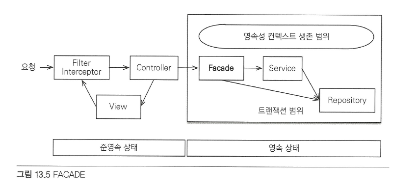
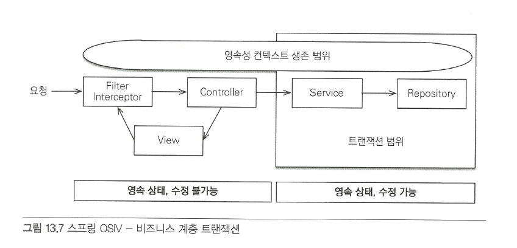

# 웹 어플리케이션과 영속성 관리
컨테이너 환경에서는 JPA 내부 동작 방식을 이해하고 있어야 문제를 해결하기 쉽다.
- [웹 어플리케이션과 영속성 관리](#웹-어플리케이션과-영속성-관리)
  - [스프링 컨테이너의 기본 전략](#스프링-컨테이너의-기본-전략)
  - [준영속상태와 지연로딩](#준영속상태와-지연로딩)
    - [글로벌 페치 전략 수정](#글로벌-페치-전략-수정)
      - [단점](#단점)
      - [JPQL Fetch Join](#jpql-fetch-join)
        - [단점](#단점-1)
      - [강제로 초기화](#강제로-초기화)
      - [FACADE 계층 추가](#facade-계층-추가)
      - [준영속 상와 지연 로딩의 문제점](#준영속-상와-지연-로딩의-문제점)
    - [OSIV(Open Session In View)](#osivopen-session-in-view)
      - [과거 OSIV: 요청 당 트랜잭션(Transaction per Request)](#과거-osiv-요청-당-트랜잭션transaction-per-request)
    - [Spring OSIV: 비즈니스 계층 트랜잭션](#spring-osiv-비즈니스-계층-트랜잭션)
      - [트랜잭션 없이 읽기](#트랜잭션-없이-읽기)
      - [주의사항](#주의사항)
## 스프링 컨테이너의 기본 전략
- 트랜잭션 범위의 영속성 컨텍스트 전략: 트랜잭션 범위와 영속성 컨텍스트의 생존 범위는 같다.
- `@Transactional`: 메소드를 실행하기 직전에 스프링의 트랜잭션 AOP 시작, 메소드 종료시에 커밋
- 트랜잭션을 커밋할 때 영속성 컨텍스트를 플러시 하고 커밋 -> 롤백할 때는 플러시 하지 않음
- 트랜잭션이 같으면 같은 영속성 컨택스트를 사용
- 트랜잭션이 다르면 다른 영속성 컨택스트를 사용
- 트랜잭션과 복잡한 멀티 스레드 상황을 스프링의 컨테이너가 처리해주기 때문에 싱글 스레드처럼 개발 할 수 있다.

## 준영속상태와 지연로딩
- 트랜잭션은 보통 서비스 계층에서 사용되고 영속성 컨텍스트도 함께 종료
- 컨트롤러나 뷰 같은 프레젠테이션 계층에서는 준영속 상태
- 컨트롤러에서 지연로딩으로 설정된 값을 참조하게 되면 예외가 발생한다.
- 준영속 상태와 변경감지
  - 변경 감지 기능은 영속성 컨택스트가 살아있는 서비스 계층까지만 동작
  - 프레젠테이션 레이어에서 영속성 컨텍스트를 가지고 있으면 각 계층이 가지는 책임이 모호해짐. 
- 준영속 상태와 지연로딩
  - 준영속 상태에서는 지연로딩이 동작하지 않는다.
  - 뷰를 렌더링 할 때 연관된 엔티티를 사용해야 될 경우 지연 로딩이라면 예외가 발생한다.
  - 문제 해결
    - 미리 로딩해둠
      - 글로벌 페치 전략 수정
      - JPQL 패치 조인(fetch join)
      - 강제로 초기화
    - OSIV를 사용해서 엔티티를 항상 영속상태로 유지
### 글로벌 페치 전략 수정
```java
@Entity
public class Order {
    @Id @GeneratedValue
    private Long id;

    @MantyToOne(fetch = FetchType.EAGER) // 즉시로딩
    private Member member;
}
```
Eager Fetch를 사용해서 미리 가져오면 예외가 발생하지 않는다.
#### 단점
- 사용하지 않는 엔티티를 로딩한다.
- N+1 문제가 발생한다.
- 하나만 조회하는 경우
```java
Order order = em.find(Order.class, 1L);
```
- 실행된 SQL
```sql
select o.*, m.*
from Order o
left outer join Member m on o.MEMBER_ID = m.MEMBER_ID
where o.id = 1 
```
Join을 사용해서 연관된 엔티티까지 한번에 조회

- JPQL을 사용하는 경우
```java
List<Order> orders = em.createQuery("select o from Order o", Order.class).getResultList();
```
- 실행된 SQL
```sql
select * from Order
select * from Member where id=?
select * from Member where id=?
select * from Member where id=?
select * from Member where id=?
```
JPA가 JPQL을 분석해서 SQL을 생성할 때 글로벌 페치 전략을 참고하지 않고 오직 JPQL 자체만 사용한다. 즉지로딩과 지연로딩을 구분하지 않는다.
-> `JPQL fetch join`으로 해결 가능

#### JPQL Fetch Join
글로벌 페치 전략을 즉시 로딩으로 사용하면 애플리케이션 전체에 영향을 주기 때문에 비효율적이다. 페치 조인을 사용할려면 조인 명령어 마지막에 fetch를 넣어면된다. 페치 조인은 N+1 문제를 해결하면서 필요한 엔티티를 미리 참조하는 현실적인 방법으로 사용된다. 

##### 단점
- 무분별하게 사용하면 레포지토리 메소드가 증가되며 프레젠테이션 계층이 데이터 접근 계층을 침범하게 된다.
- 프레젠테이션 계층은 필요한 함수마다 다른 레포지토리 메소드를 호출하게 되어 의존성이 증가된다.
- 이를 해결하기 위해서 모두 페치 조인을 사용하게 할 수 도 있지만 적절한 타협점을 찾아야한다.

#### 강제로 초기화
연관된 엔티티의 값을 참조하여 강제로 초기화를 시켜준다. 또는 하이버네이트의 `initialize()` 메소드를 사용하면 프록시를 강제로 초기화할 수 있다. 

JPA는 프록시를 초기화하는 메소드가 없다. JPA는 초기화 여부만 확인할 수 있다.
```java
PersistenceUnitUtil persistenceUnitUtil = em.getEntityManagerFactory().getPersistenceUnitUtil();
boolean isLoaded = persistenceUnitUtil.isLoaded(order.getMember());
```

프록시를 초기화하는 역할을 서비스 계층이 담당하게 되면 뷰가 필요한 엔티티에 따라서 서비스 계층의 로직을 변경해야한다. 이렇게 되면 프레젠테이션 계층이 서비스 계층을 침범하는 상황이다. 그렇기 때문에 프록시 초기화 역할을 분리해주는 FACADE 계층을 사용할 수 있다.

#### FACADE 계층 추가


그림처럼 프레젠테이션 계층과 서비스 계층 사이에 FACADE 계층을 추가하여 사용할 수 있다. 뷰를 위한 프록시 초기화를 해당 계층에서 담당한다. 이를 통해 논리적인 의존성을 분리할 수 있다.
- FACADE 계층의 역할과 특징
  - 프레젠테이션 계층과 도메인 모델 계층 간의 논리적 의존성 분리
  - 프록시 객체 초기화
  - 서비스 계층을 호출해서 비즈니스 로직 실행
  - 레포지토리를 직접 호출해서 뷰가 요구하는 엔티티를 참조

```java
class OrderFacade {
    @Autowired
    private OrderService orderService;

    public Order findOrder(Long id){
        Order order = orderService.findOrder(id);
        order.getMember().getName(); // 프록시 강제 초기화
        return order;
    }
}
```
```java
class OrderService {
    public Order findOrder(Long id){
        return orderRepository.findOrder(id);
    }
}
```
- FACADE 계층을 통해서 프레젠테이션 계층과 서비스 계층의 의존성을 제거
- FACADE 계층은 프록시 초기화만 담당하기 때문에 서비스 계층을 단순 호출하는 코드로 이루어짐

#### 준영속 상와 지연 로딩의 문제점
- 엔티티를 미리 초기화하는 방법은 오류 발생 가능성이 높다.
- FACADE를 사용해서 의존성을 낮출 수 있지만 많은 조회 메소드가 필요하다.
- 엔티티가 프레젠테이션 계층에서 준영속 상태이기 때문에 발생하는 문제 -> 뷰에서도 지연로딩 사용을 위해 `OSIV` 사용

### OSIV(Open Session In View)
> 영속성 컨텍스트를 뷰까지 열어줌

#### 과거 OSIV: 요청 당 트랜잭션(Transaction per Request)
- 요청이 도착하면 서블릿 필터 또는 스프링 인터센터에서부터 트랜잭션을 시작함
- 프레젠테이션 레이어에서도 지연 로딩을 할 수 있게 되어 FACADE 계층이 필요없다
- 문제점
  - 단순 응답에만 데이터를 변경하고 데이터베이스는 유지하고 싶은 경우 컨트롤러에서 값을 변경하게 되면 프랜잭션이 커밋되버린다.
  - 해결법
    - 엔티티를 읽기 전용 인터페이스로 제공: 엔티티를 읽기 전용 인터페이스만 제공하여 수정을 막는다.
    - 엔티티 레핑: Wrapper를 생성하여 엔티티는 수정할 수 없고 참조 메소드만 호출할 수 있게한다.
    - DTO만 반환: 엔티티 대신 데이터를 전달하는데 사용되는 DTO를 사용한다.
### Spring OSIV: 비즈니스 계층 트랜잭션
- 하이버네이트 OSIV 서블릿 필터
- 하이버네이트 OSIV 스프링 인터셉터
- JPA OEIV 서블릿 필터
- JPA OEIV 스프링 인터셉터



영속성은 프레젠테이션 레이어에서도 유지되지만 트랜잭션은 서비스 레이어에서만 유지한다.

#### 트랜잭션 없이 읽기
- 단순 읽기에는 트랜잭션이 필요없다.
- 프레젠테이션 레이어까지 영속성 컨텍스트 유지
- 프레젠테이션 레이어는 트랜잭션이 없기 때문에 엔티티 수정 불가
- 영속성 컨텍스트가 유지되어 있기 때문에 참조 가능
- 프레젠테이션 레이어에서 엔티티를 변경해도 OSIV 인터셉터는 em.close()를 호출하고 플러시 하지 않는다.
- 강제로 em.flush()를 호출하게 되면 예외 발생

#### 주의사항
- 프레젠테이션 레이어에서 엔티티를 수정하고 트랜잭션이 있는 서비스 계층을 호출하게 되면 변경사항이 커밋된다.