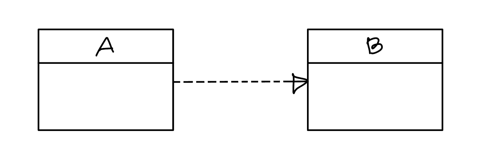
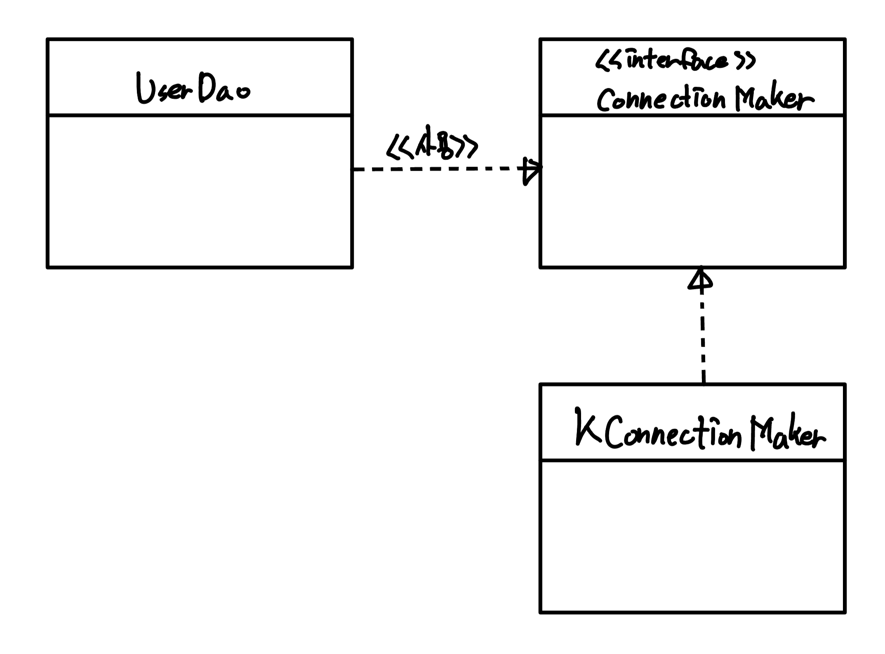

# 의존관계 주입(Dependency Injection, DI)
- [의존관계 주입(Dependency Injection, DI)](#의존관계-주입dependency-injection-di)
  - [제어의 역전과 의존관계 주입](#제어의-역전과-의존관계-주입)
  - [런타임 의존관계 설정](#런타임-의존관계-설정)
    - [의존관계](#의존관계)
    - [UserDao의 의존관계](#userdao의-의존관계)
      - [의존관계 주입의 조건](#의존관계-주입의-조건)
    - [UserDao의 의존관계 주입](#userdao의-의존관계-주입)
        - [의존관계 주입을 위한 코드](#의존관계-주입을-위한-코드)
  - [의존관계 검색(DL)과 주입(DI)](#의존관계-검색dl과-주입di)
        - [예시](#예시)
      - [의존관계 검색 vs 의존관계 주입](#의존관계-검색-vs-의존관계-주입)
      - [차이점](#차이점)
  - [의존관계 주입 응용](#의존관계-주입-응용)
    - [의존관계 주입의 장점](#의존관계-주입의-장점)
      - [기능 구현의 교환](#기능-구현의-교환)
      - [부가기능 추가](#부가기능-추가)


## 제어의 역전과 의존관계 주입
스프링이 제공하는 IoC 방식의 핵심을 `의존관계 주입(DI)`라고 명명했다
> 필자는 Dependency Injection이 "의존성 주입" 보다는 "의존관계 주입"이라고 번역하는게 더 적합하다고 한다. 엄밀히 말해서 오브젝트는 다른 오브젝트에 주입할 수 있는게 아니고 레퍼런스가 전달되는 것 뿐이다. 레퍼런스를 제공받아 다른 오브젝트와 다이나믹한 의존관계를 만드는 것이 핵심이라고 한다.

## 런타임 의존관계 설정
### 의존관계
> 의존 관계란 무엇일까

두 개의 클래스 또는 모듈이 의존관계가 있다면 방향성을 부여해줘야한다. 의존하는 클래스가 의존받는 모듈 쪽으로 화살표를 그려준다.



"의존"이란 의존 대상이 변하면 의존하는 쪽이 변한다는 것을 의미한다. 위의 그림에서는 B가 변하면 A에 영향을 미친다. A가 B에 의존하고 있기 때문에 B를 수정하면 A도 수정해야한다. 하지만 만대로 B는 A에 의존하지 않기 때문에 A의 변경은 B에 영향을 미치지 않는다.

### UserDao의 의존관계


- UserDao는 ConnectionMaker 인터페이스에 의존한다.
- KConnectionMaker가 변경돼도 UserDao는 영향이 없다.
- 인터페이스를 사용하여 UserDao와 구현 크래스는 결합도가 낮다. 

설계 기준이 아닌 런타임 시에 오브젝트 사이에 형성되는 의존관계도 있다. 인터페이스를 사용하여 의존관계를 설정하면 런타임 시에 사용할 오브젝트가 어떤 클래스로 만든 것인지 미리 알 수 없다.

실제 사용 대상인 오브젝트를 `의존 오브젝트(dependent object)`라고 한다. 

`의존관계 주입`은 구체적인 의존 오브젝트와 해당 오브젝트를 사용할 주체를 런타임시에 연결해주는 작업을 말한다. 

#### 의존관계 주입의 조건
- 인터페이스에만 의존하고 있어야한다. -> 클래스 모델이나 코드에는 런타임 시점의 의존관계가 드러나지 않는다. 
- 런타임 시점의 의존관계는 컨테이너나 팩토리 같은 제3의 존재가 결정한다.
- 의존관계는 사용할 오브젝트에 대한 레퍼런스를 외부에서 제공해줌으로써 만들어진다.

> 설계 시점에는 알지 못했던 두 오브젝ㅌ의 관계를 맺도록 도와주는 제3의 존재가 있다.
>
> 제3의 존재는 DaoFactory, 애플리케이션 컨텍스트, 빈 팩토리, IoC 컨테이너 등이 있다.

### UserDao의 의존관계 주입
관계 설정의 책임 분리 전에는 UserDao가 구현 클래스를 알고있었다.

```java
public UserDao() {
    connectionMaker = new NConnectionMaker();
}
```
해당 코드의 문제는 이미 런타임 시의 의존관계가 하드 코딩되어있다는 것이다. 이를 해결하기 위해서 팩토리를 사용해서 팩토라기 런타임 시점에 ConnectionMaker 오브젝트를 결정하고 생성한 후에 의존관계를 형성해준다. 팰토리 사용으로 위의 [의존관계 주입의 조건](#의존관계-주입의-조건) 세가지 모두를 만족할 수 있다. 팩토리를 사용함으로써 DI를 이용한 것이다. 

UserDao는 인터페이스에만 의존관계를 가지고 있고 런타임 시점의 의존관계는 팩토리가 형성해준다. 이 팩토리를 DI 컨테이너라고 해도 될 것이다. 

주입은 외부에서 내부로 오브젝트의 레퍼런스를 넘겨주는 작업이다. 가장 손쉽게 넘겨줄 수있는 방법을 생성자를 넘겨주는 것이다. 

##### 의존관계 주입을 위한 코드
```java
public class UserDao {
    private ConnectionMaker connectionMaker;

    public UserDao(ConnctionMaker connectionMaker){
        this.connectionMaker = connectionMaker; 
    }
    ...
}
```

DI는 자신이 사용할 오브젝트에 대한 선택과 생성 제어권을 외부로 넘기고 자신은 제3자에게 주입 받아서 사용한다. 스프링 컨테이너의 IoC는 주로 의존관계 주입 또는 DI에 초점이 맞춰져있다.

## 의존관계 검색(DL)과 주입(DI)
스프링은 의존관계를 주입시켜주기도 하지만 런타임 시에 의존관계를 결정하기 때문에 `의존관계 검색(dependency lookup)`이라고도 불리는 것도 있다. 

의존관계 검색은 런타임 시에 의존관계를 맺을 오브젝트를 결정하고 생성하는 작업을 외부 컨테이너에 맡기지만 가져올 때는 메소드나 생성자를 통한 주입 대신 스스로 컨테이너에게 요청하는 방법을 사용한다. 

##### 예시
```java
public UserDao() {
    DaoFactory daoFactory = new DaoFactory();
    this.connectionMaker = daoFactory.connectionMaker();
}
```
예시에서 UserDao는 connectionMaker로 어떤 오브젝트를 가져오는지 모른다. 하지만 외부에서 주입 받는 것이 아니라 스스로 IoC 컨테이너(DaoFactory)에게 요청하고 있다. 애플리케이션 컨텍스트는 미리 정해놓은 이름들 전달 받아서 그 이름에 해당하는 오브젝트를 찾아서 반환한다. 이를 검색이라고 한다. 

스프링의 IoC 컨테이너인 애플리케이션 컨텍스트는 getBean() 메소드를 사용해서 의존관계를 검색한다.

```java
public UserDao() {
    AnnotationConfigApplicationContext context = new AnnotaionConfigApplicationContext(DaoFactory.java);
    this.connectionMaker = context.getBean("connectionMaker", ConnectionMaker.class);
}
```

의존관계 검색은 기존의 의존관계 주입의 모든 장점을 갖고있다. 방법이 조금 다르지만 IoC 원칙에도 잘 맞는다.

#### 의존관계 검색 vs 의존관계 주입

의존관계 검색은 오브젝트 팩토리 클래스와 스프링 API가 나타난다. 애플리케이션 컴포넌트가 컨테이너와 같이 성격이 다른 오브젝트에 의존하게 되는 것이므로 바람직하지 않다. 따라서 의존관계 주입 방식이 좋다.

하지만 애플리케이션의 기동 시점에서 적어도 한 번은 의존관계 검색 방식을 사용해 오브젝트를 가져와야한다. 스태틱 메소드인 main()에서는 DI를 이용해 오브젝트를 주입받을 방법이 없다. 

사용자의 요청을 받을 때마다 main()과 비슷한 역할을 하는 서블릿에서 스프링 컨테이너에 담긴 오브젝트를 사용하기위해 한 번은 의존관계 검색 방식을 사용해 오브젝트를 가져와야한다. 서블릿은 스프링이 미리 만들어서 제공하기 때문에 직접 구현할 필요는 없다. 

#### 차이점
- 의존관계 검색에서 검색하는 주체는 자신이 스프링 빈일 필요가 없다.
- 의존관계 주입에서 UserDao와 ConnectionMaker 사이에 DI가 적용되려면 UserDao도 반드시 빈 오브젝트여야한다. 
  - 컨테이너가 오브젝트를 주입하려면 주입 당하는 대상의 생성과 초기화 권한을 갖고있어야한다. 

> #### DI 받는다.
> 외부에서 파라미터로 오브젝트를 넘겨준다고 다 DI가 아니다.
> 
> 주입 받은 파라미터는 다이나믹헤가 구현 클래스를 결정해서 제공받을 수 있어야한다. 

## 의존관계 주입 응용
### 의존관계 주입의 장점
> 코드에 런타임 클래스에대한 의존관계가 나타나지 나타나지 않고 인터페이스를 통해서 결합도 낮은 코드를 생성하기 때문에 의존 관계에 있는 대상이 바껴도 자신은 영향을 받지 않는다. 

#### 기능 구현의 교환
배포 환경과 개발 환경, 테스트 환경에서 사용하는 데이터베이스는 다르다. 각 환경에서 데이터베이스를 교환하기 쉽게하려면 DI를 사용해야한다. `@Configuration`이 붙은 DaoFatory를 사용한다면  ConnectionMaker를 생성해주는 자바 빈을 교환해주는 것으로 해결 가능하다.

- 로컬 환경 사용시
```java
@Bean
public ConnectionMaker connectionMaker() {
  return new LocalDBConnectionMaker();
}
```
- 배포 환경 사용시
```java
@Bean 
public ConnectionMaker connectionMaker() {
  return new ProductionDBConnectionMaker();
}
```

#### 부가기능 추가
만약 DAO가 DB에 접근하는 횟수를 카운팅하는 기능을 추가하려고 할 때, DI 방식을 사용하면 모든 DB 접근 코드에 카운팅하는 코드를 추가하지 않아도 된다. 그리고 모든 접근 코드에 카운팅을 추가하게되면 여러개의 관심사를 가지는 코드가 생기게 된다.

DI 컨테이너에서 추가하기 위해서는 DAO와 DB 커넥션을 만드는 오브젝트 사이에 카운팅하는 오브젝트를 추가하면 된다. 그 후 컨테이너가 사용하는 설정정보만 수정해서 런타임 의존관계만 새롭게 정의해주면 된다.

- CountingConnectionMaker
```java
public class CountingConnectionMaker implements ConnectionMaker {
  int counter = 0;
  private ConnectionMaker realConnectionMaker;
  
  public CountingConnectionMaker(ConnectionMaker realConnectionMaker){
    this.realConnectionMaker = realConnectionMaker;
  }

  public Connection makeConnection() throws ClassNotFoundException, SQLException {
    this.counter++;
    return realConnectionMaker;
  }

  public int getCounter(){
    return this.counter;
  }
}
```
- CountingDaoFactory
```java
@Configuration
public class CountingDaoFactory {
  @Bean
  public UserDao userDao() {
    return new UserDao(connectionMaker());
  }
  
  @Bean
  public ConnectionMaker connecitonMaker() {
    return new CountingConnectionMaker(realConnectionMaker());
  }

  @Bean
  public ConnectionMaker realConnectionMaker(){
    return new KConnectionMaker();
  }
}
```
- UserDaoConnectionCountingTest
```java
public class UserDaoConnectionCountingTest {
  public static void main(String[] args) throws ClassNotFoundExceptoin, SQLException {
    AnnotationConfigApplicationConetext context = new AnnotationConfigApplicationContext(CountingDaoFactory.class);
    UserDao dao = context.getBean("userDao", UserDao.class);

    // ...

    CountingConnectionMaker ccm = context.getBean("connectionMaker", CountingConnectionMaker.class);
    System.out.println(ccm.getCounter());
  }
}
```

DI의 장점은 `관심사의 분리(SoC)`를 통해서 얻어지는 응집도에서 나온다.
