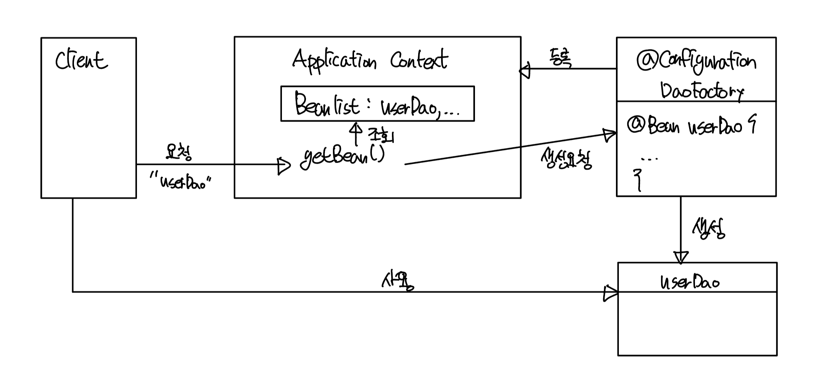

# 제어의 역전(IOC, Inversion Of Control)
- [제어의 역전(IOC, Inversion Of Control)](#제어의-역전ioc-inversion-of-control)
  - [오브젝트 팩토리](#오브젝트-팩토리)
    - [팩토리](#팩토리)
    - [설계도로서의 팩토리](#설계도로서의-팩토리)
    - [오브젝트 팩토리의 활용](#오브젝트-팩토리의-활용)
  - [제어권의 이전을 통한 제어관계 역전](#제어권의-이전을-통한-제어관계-역전)
  - [스프링의 IoC](#스프링의-ioc)
    - [오브젝트 팩토리를 이용한 스프링 IoC](#오브젝트-팩토리를-이용한-스프링-ioc)
      - [애플리케이션 컨텍스트와 설정정보](#애플리케이션-컨텍스트와-설정정보)
    - [DaoFactory를 사용하는 애플리케이션 컨텍스트](#daofactory를-사용하는-애플리케이션-컨텍스트)
    - [애플리케이션 컨텍스트의 동작 방식](#애플리케이션-컨텍스트의-동작-방식)
      - [DaoFactory를 오브젝트 팩토리로 직접 사용햇을 때와 비교했을 때 장점](#daofactory를-오브젝트-팩토리로-직접-사용햇을-때와-비교했을-때-장점)
  - [스프링 IoC의 용어 정리](#스프링-ioc의-용어-정리)
    - [빈(Bean)](#빈bean)
    - [빈 팩토리(Bean Factory)](#빈-팩토리bean-factory)
    - [애플리케이션 컨텍스트(Application Context)](#애플리케이션-컨텍스트application-context)
    - [설정정보/설정 메타정보(Configuration metadata)](#설정정보설정-메타정보configuration-metadata)
    - [컨테이너 또는 IoC 컨테이너](#컨테이너-또는-ioc-컨테이너)
    - [스프링 프레임워크](#스프링-프레임워크)

예시를 통해서 알아보자
## 오브젝트 팩토리 
- 이전까지의 코드에서 UserDaoTest가 ConnectionMaker를 선택하는 책임을 갖게됐다.
- UserDao와 ConnectionMaker 구현 클래스의 오브젝트 생성과 두 오브젝트의 관계 형성 을 분리해주어야한다.

### 팩토리
팩토리는 객체의 생성방법을 정해줘서 오브젝트를 생성한다.
```java
public class DaoFactory {
    public UserDao userDao(){
        ConnecitonMaker connectionMaker = new NConnectionMaker();
        UserDao userDao = new UserDao(connectionMaker);
        return userDao;
    }
}
```
- 위 팩토리를 사용하면 UserDaoTest는 UserDao가 어떻게 만들어지는지 신경쓰지 않고 테스트할 수 있다.
```java
public class UserDaoTest {
    public static void main(String[] args) throws ClassNotFoundExceptoin, SQLException {
        UserDao dao = new DaoFactroy().userDao();
        ...
    }
}
```
### 설계도로서의 팩토리
- UserDao와 ConnectionMaker는 각 애플리케이션의 핵심적인 데이터 로직과 기술 로직을 담당하고 있다.
- DaoFactory는 각 오브젝트들을 구성하고 그 관계를 정의하는 책임을 갖는다
- UserDao와 ConnectionMaker는 실질적인 로직을 담당하는 컴포넌트, DaoFactory는 구조와 관계를 정의하는 설계도를 담당한다.
- 애플리케이션의 컴포넌트 역할을 하는 오브젝트와 애플리케이션의 구조를 결정하는 오브젝트를 분리했다는 장점을 가짐

### 오브젝트 팩토리의 활용
- DaoFactory에 UserDao가 아닌 다른 DAO를 생성하는 기능을 넣게되면 ConnectionMaker 구현 클래스의 오브젝트를 생성하는 코드가 메소드마다 반복된다. 
```java
public class DaoFactory {
    public UserDao userDao(){
        return new UserDao(new KConnectionMaker());
    }
    public AccountDao accountDao(){
        return new AccountDao(new KConnectionMaker());
    }
    public MessageDao messageDao(){
        return new MessageDao(new KConnectionMaker());
    }
}
```
중복 문제를 해결하기 위해서는 분리하는게 가장 좋은 방법이다.
```java
public class DaoFactory {
    private ConnectionMaker connectionMaker(){
        return new KConnectionMaker();
    }
    public UserDao userDao(){
        return new UserDao(connectionMaker());
    }
    public AccountDao accountDao(){
        return new AccountDao(connectionMaker());
    }
    public MessageDao messageDao(){
        return new MessageDao(coonnectionMaker());
    }
}
```
## 제어권의 이전을 통한 제어관계 역전
> 제어의 역전이란 간단히 프로그램의 제어 흐름 구조가 뒤바뀌는 것이라고 설명할 수 있다.

일반적으로 프로그램의 흐름은 main() 메소드와 같이 프로그램이 시작되는 지점에서 다음에 사용할 오브젝트를 결정 -> 생성 -> 호출 하는 작업이 반복된다. 모든 종류의 작업을 사용하는 쪽에서 제어하는 구조이다.

제어의 역전에서는 오브젝트는 자신이 사용할 오브젝트를 선택하지도 생성하지도 않는다. 제어의 권한을 자신이 아닌 다른 대상에게 위임한다. 

서블릿을 예로들면, 일반적인 자바 프로그램은 main()에서 시작해서 개발자가 미리 정한 순서를 따라 오브젝트가 생성되고 실행된다. 하지만 서블릿을 개발해서 서버에 배포할 수는 있지만, 개발자가 직접 실행시킬순 없다. 서블릿에 대한 제어 권한을 가진 컨테이너가 적절한 시점에 서블릿 클래스의 오브젝트를 생성하고 호출한다. 

> ### 라이브러리 vs 프레임워크
> 라이브러리는 내가 불러서 사용 프레임워크는 나를 불러서 사용

## 스프링의 IoC
### 오브젝트 팩토리를 이용한 스프링 IoC
#### 애플리케이션 컨텍스트와 설정정보
> #### Bean
> - 스프링이 제어권을 가지고 직접 만들고 관계를 부여하는 오브젝트 
> -  스프링 빈은 스프링 컨테이너가 생성과 관계설정, 사용 등을 제어해주는 제어의 역전이 적용된 오브젝트를 의미한다.
> #### Bean Factory
> - 빈의 생성과 관계 설정 같은 제어를 담당하는 IoC 오브젝트
> - 보통 빈 팩토리보다는 애플리케이션 컨텍스트를 주로 사용

지금의 DaoFactory는 설정정보를 자바 코드를 사용하여 입력되어잇다. 애플리케이션 컨텍스트는 직접 정보를 가지고 있지는 않고 외부에서 가져와서 활용한다.

### DaoFactory를 사용하는 애플리케이션 컨텍스트
- DaoFactory를 스프링 빈 팩토리가 사용할 수 있는 설정 정보로 만들어보자.
- `@Configuration`: 스프링이 빈 팩토리를 위한 오브젝트 설정을 담당하는 클래스라고 인식할 수 있게 해준다.
- `@Bean`: 오브젝트를 생성해준다. 
```java
@Configuration
public class DaoFactory {
    @Bean
    public UserDao userDao() {
        return new UserDao(connectionMaker());
    }
    @Bean
    public ConnectionMaker connectionMaker() {
        return new KConnectionMaker();
    }
}
```

이제 DaoFactory를 설정정보로 사용하는 애플리케이션 컨텍스트를 만들어보자
- `AnnotationConfigApplicationContext`를 사용하면 `@Configuration`이 붙은 자바 코드를 설정정보로 사용할 수 있다.
```java
public class UserDaoTest {
    public static main(String[] args) throws ClassNotFoundException, SQLException {
        ApplicationContect context = new AnnotaionConfigApplicationContext(DaoFactory.class);
        UserDao dao = context.getBean("userDao", UserDao.class);
    }
}
```
`getBean()` 메소드를 통해서 ApplicationContext가 관리하는 오브젝트를 요청할 수 있다. getBean()의 "userDao"는 ApplictionContext에 등록된 빈의 이름이다. DaoFactorydptj @Bean이 붙은 userDao의 이름을 그대로 가져와서 쓴다.

### 애플리케이션 컨텍스트의 동작 방식
스프링의 애플리케이션 컨텍스트는 오브젝트 팩토리와 같은 역할을 한다. 스프링에서는 애플리케이션 컨텍스트를 IoC 컨테이너 또는 스프링 컨테이너라고도 부른다. 애플리케이션 컨텍스트는 `ApplicationContext` 인터페이스를 구현하고 ApplicationContext는 빈 팩토리가 구현하는 BeanFactory를 상속했기 때문에  일종의 빈 팩토리이다. 애플리케이션 컨텍스트가 스프링의 가장 대표적인 오브젝트 이기 때문에 애플리케이션 컨텍스트를 그냥 스프링이라고 부르는 개발자도 있다고 하는데 용어 통일좀 했으면 좋겠다. 삼다수 아이스크림 같네.

- DaoFactory는 DAO 오브젝트를 생성하고 DB 생성 오브젝트와 관계를 맺어주지만 애플리케이션 컨텍스트는 애플리케이션에서 IoC를 적용해서 관리할 모든 오브젝트에 대한 생성과 관계 설정을 담당한다. 
- ApplicationContext에는 DaoFactory와 달리 직접 오브젝트를 생성하고 관계를 맺어주는 코드가 없고 생성정보와 연관관계 정보는 별도의 설정정보를 통해 얻는다.
- 오브젝트 팩토리에 작업을 위임하는 경우도 있다.



- 애플리케이션 컨텍스트는 DaoFactory 클래스를 설정정보로 등록해두고 @Bean이 붙은 메소드의 이름을 가져와서 빈 목록을 만든다.
- 클라이언트가 애플리케이션 컨텍스르의 getBean() 메소드를 호출하면서 빈을 요청한다. 
- 빈 목록에서 있으면 반환하고 없으면 오브젝트 팩토리에서 생성을 요청한다.

#### DaoFactory를 오브젝트 팩토리로 직접 사용햇을 때와 비교했을 때 장점
- 클라이언트는 구체적인 팩토리 클래스를 알 필요가 없다.
- 애플리케이션 컨텍스트를 종합 IoC 서비스를 제공해준다.
- 애플리케이션 컨텍스트는 빈을 검색하는 다양한 방법을 제공한다.

## 스프링 IoC의 용어 정리
### 빈(Bean)
- 빈 또는 빈 오브젝트는 스프링이 IoC 방식으로 관리하는 오브젝트라는 뜻
- 관리되는 오브젝트(Managed Object)라고 하기도함
- 스프링 애플리케이션에서 만들어지는 모든 오브젝트가 다 빈은 아니다.

### 빈 팩토리(Bean Factory)
- 스프링의 IoC를 담당하는 핵심 컨테이너
- 빈을 등록, 생성, 조회, 반환 등 부가적인 빈을 관리하는 기능 담당
- 보통 빈 팩토리를 바로 사용하는 것이 아닌 애플리케이션 컨텍스트를 이용한다.

### 애플리케이션 컨텍스트(Application Context)
- 빈 팩토리를 확장한 IoC 컨테이너이다.
- 빈 팩토리의 기능 + 스프링이 제공하는 각종 부가 서비스 추가 제공
- `ApplicationContext`는 `BeanFactory`를 상속한다.

### 설정정보/설정 메타정보(Configuration metadata)
- 애플리케이션 컨텍스트 또는 빈 팩토리가 IoC를 적용하기 위해서 사용하는 메타 데이터
- 컨테이너에 어떤 기능을 세팅하거나 조정하는 경우에 사용
- IoC 컨테이너에 의해 관리되는 애프리케이션 오브젝트를 생성하고 구성할 때 사용

### 컨테이너 또는 IoC 컨테이너
- 애플리케이션 컨텍스트나 빈 팩토리를 컨테이너 또는 IoC 컨테이너라고 한다.
- 컨테이너라는 말 자체가 IoC의 개념을 담고 있다. 

### 스프링 프레임워크
- IoC 컨테이너, 애플리케이션 컨텍스트를 포함해서 스프링이 제공하는 모든 기능을 통틀어 호칭